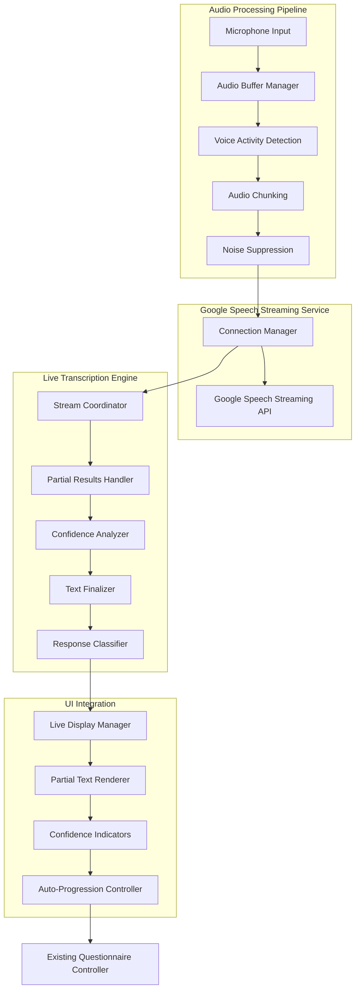
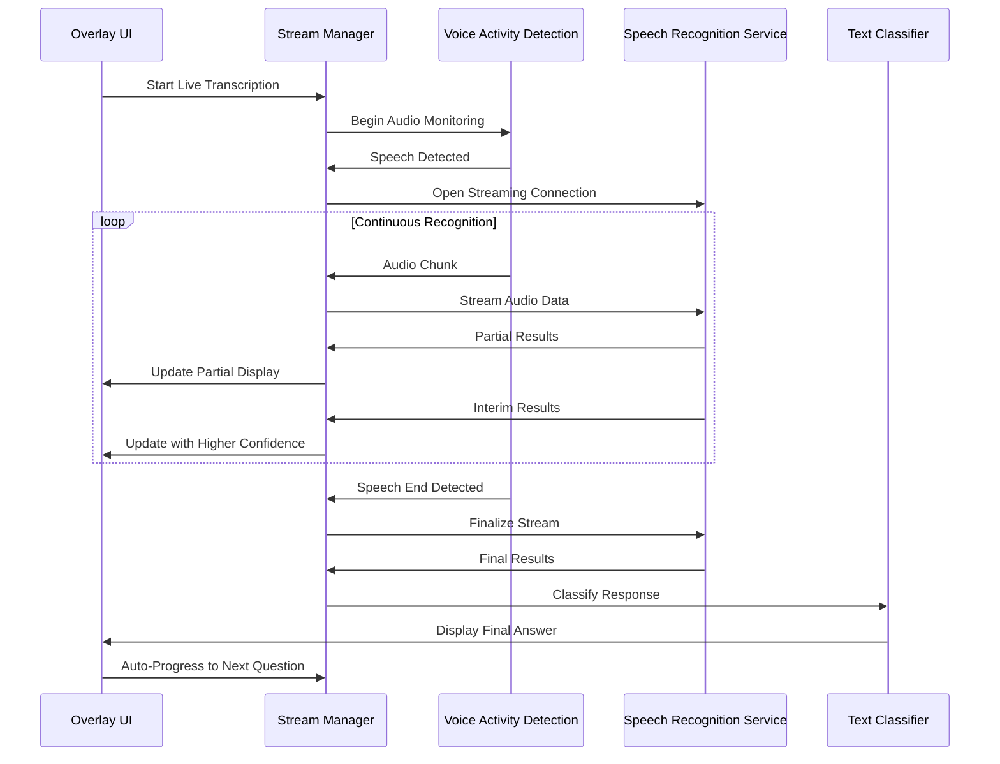

# Design Document

## Overview

The Live Transcription Enhancement transforms the existing Speech Overlay Application from pause-based speech processing to continuous, real-time transcription similar to video calling applications. This enhancement implements streaming speech recognition with multiple service providers, real-time partial results display, and intelligent speech end detection while maintaining compatibility with the existing overlay interface.

The design prioritizes low-latency transcription, high accuracy across multiple English accents, and seamless integration with the current questionnaire workflow. The architecture supports multiple speech recognition backends (Google Speech-to-Text streaming, Azure Speech Services, and local Whisper models) with automatic fallback capabilities.

## Architecture

### High-Level Architecture



### Streaming Recognition Flow



## Components and Interfaces

### 1. Streaming Audio Manager

#### Audio Stream Controller
```typescript
interface AudioStreamController {
  startStreaming(): Promise<void>;
  stopStreaming(): void;
  pauseStreaming(): void;
  resumeStreaming(): void;
  getStreamingStatus(): StreamingStatus;
  configureAudioSettings(settings: AudioStreamSettings): void;
}

interface AudioStreamSettings {
  sampleRate: number;
  channels: number;
  chunkSize: number;
  bufferDuration: number;
  noiseSuppressionLevel: 'low' | 'medium' | 'high';
}
```

**Responsibilities:**
- Manage continuous audio capture with configurable chunk sizes
- Implement voice activity detection for speech start/end
- Handle audio preprocessing and noise suppression
- Buffer audio data for streaming to recognition services

#### Voice Activity Detection
```typescript
interface VoiceActivityDetector {
  detectSpeechStart(audioChunk: Float32Array): boolean;
  detectSpeechEnd(audioChunk: Float32Array): boolean;
  configureSensitivity(level: number): void;
  getEnergyLevel(): number;
  isCurrentlySpeaking(): boolean;
}
```

**Responsibilities:**
- Real-time speech activity detection using energy and spectral analysis
- Configurable sensitivity for different environments
- Speech end detection with configurable timeout
- Background noise adaptation

### 2. Streaming Recognition Services

#### Google Speech Service Manager
```typescript
interface GoogleSpeechServiceManager {
  initializeGoogleSpeech(config: GoogleSpeechConfig): Promise<void>;
  startStreamingRecognition(): Promise<GoogleStreamingSession>;
  reconnectService(): Promise<void>;
  testConnectivity(): Promise<boolean>;
  getConnectionStatus(): ConnectionStatus;
}

interface GoogleStreamingSession {
  sendAudioChunk(chunk: ArrayBuffer): void;
  onPartialResult(callback: (result: PartialResult) => void): void;
  onFinalResult(callback: (result: FinalResult) => void): void;
  onError(callback: (error: StreamingError) => void): void;
  close(): void;
}
```

**Responsibilities:**
- Manage Google Speech-to-Text streaming connections
- Handle reconnection logic and session management
- Process streaming audio data to Google's API
- Handle Google-specific error conditions and rate limiting

#### Google Speech Streaming Implementation
```typescript
interface GoogleSpeechStreaming extends StreamingSession {
  configureStreamingRecognition(config: GoogleStreamingConfig): void;
  enableInterimResults(enable: boolean): void;
  setLanguageCode(languageCode: string): void;
  enableAutomaticPunctuation(enable: boolean): void;
}

interface GoogleStreamingConfig {
  encoding: 'LINEAR16' | 'FLAC' | 'MULAW';
  sampleRateHertz: number;
  languageCode: string;
  enableInterimResults: boolean;
  enableAutomaticPunctuation: boolean;
  model: 'latest_long' | 'latest_short' | 'command_and_search';
}
```


### 3. Live Transcription Engine

#### Stream Coordinator
```typescript
interface StreamCoordinator {
  processPartialResult(result: PartialResult): void;
  processInterimResult(result: InterimResult): void;
  processFinalResult(result: FinalResult): void;
  getCurrentTranscription(): LiveTranscription;
  resetTranscription(): void;
}

interface LiveTranscription {
  partialText: string;
  confirmedText: string;
  confidence: number;
  wordTimestamps: WordTimestamp[];
  isComplete: boolean;
}
```

**Responsibilities:**
- Coordinate results from streaming recognition services
- Merge partial and interim results into coherent transcription
- Handle text corrections and updates
- Manage transcription state and completion detection

#### Confidence Analyzer
```typescript
interface ConfidenceAnalyzer {
  analyzeWordConfidence(words: WordResult[]): ConfidenceAnalysis;
  identifyUncertainWords(transcription: LiveTranscription): UncertainWord[];
  calculateOverallConfidence(transcription: LiveTranscription): number;
  shouldRequestConfirmation(transcription: LiveTranscription): boolean;
}

interface ConfidenceAnalysis {
  overallConfidence: number;
  uncertainWords: UncertainWord[];
  recommendedAction: 'accept' | 'confirm' | 'retry';
}
```

### 4. UI Integration Components

#### Live Display Manager
```typescript
interface LiveDisplayManager {
  updatePartialTranscription(text: string, confidence: number): void;
  highlightUncertainWords(words: UncertainWord[]): void;
  showFinalTranscription(transcription: LiveTranscription): void;
  displayStreamingStatus(status: StreamingStatus): void;
  showConfidenceIndicators(confidence: number): void;
}
```

**Responsibilities:**
- Real-time update of transcription display in overlay
- Visual distinction between partial and confirmed text
- Confidence indicators and uncertain word highlighting
- Streaming status and connection indicators

#### Response Finalization Controller
```typescript
interface ResponseFinalizationController {
  detectSpeechCompletion(transcription: LiveTranscription): boolean;
  classifyResponse(text: string): ResponseClassification;
  presentFinalAnswer(classification: ResponseClassification): void;
  enableManualProgression(): void;
  resetCurrentResponse(): void;
}

interface ResponseClassification {
  type: 'yes' | 'no' | 'date_time' | 'not_applicable' | 'unclear';
  confidence: number;
  extractedValue: any;
  requiresConfirmation: boolean;
}
```

#### Intelligent Answer Detector
```typescript
interface IntelligentAnswerDetector {
  detectYesNoResponse(text: string): YesNoDetection;
  detectDateResponse(text: string): DateDetection;
  detectDateTimeResponse(text: string): DateTimeDetection;
  detectNotApplicableResponse(text: string): NotApplicableDetection;
  analyzeResponseCompleteness(text: string, questionType: QuestionType): CompletenessAnalysis;
}

interface YesNoDetection {
  isYesNoResponse: boolean;
  value: 'yes' | 'no' | null;
  confidence: number;
  matchedPhrases: string[];
}

interface DateDetection {
  isDateResponse: boolean;
  extractedDate: Date | null;
  confidence: number;
  originalText: string;
  parsedComponents: DateComponents;
}

interface DateTimeDetection {
  isDateTimeResponse: boolean;
  extractedDateTime: Date | null;
  confidence: number;
  originalText: string;
  parsedComponents: DateTimeComponents;
}

interface DateComponents {
  day?: number;
  month?: number | string;
  year?: number;
  format: 'dmy' | 'mdy' | 'ymd' | 'natural';
}

interface DateTimeComponents extends DateComponents {
  hour?: number;
  minute?: number;
  period?: 'am' | 'pm';
  timeFormat: '12h' | '24h' | 'natural';
}
```

**Responsibilities:**
- Detect Yes/No responses including variations like "yeah", "nope", "affirmative", "negative"
- Parse date responses in multiple formats: "12 September 1992", "September 12th 1992", "12/09/1992"
- Parse date-time responses: "12 September 1992 11:15 AM", "September 12th at 11:15 in the morning"
- Detect "Not Applicable" responses including "N/A", "not applicable", "doesn't apply"
- Analyze response completeness to determine if user has finished answering

## Data Models

### Streaming Data Structures

```typescript
interface PartialResult {
  transcript: string;
  confidence: number;
  isFinal: boolean;
  stability: number;
  words?: WordResult[];
}

interface InterimResult {
  transcript: string;
  confidence: number;
  words: WordResult[];
  alternatives?: Alternative[];
}

interface FinalResult {
  transcript: string;
  confidence: number;
  words: WordResult[];
  alternatives: Alternative[];
  languageCode?: string;
}

interface WordResult {
  word: string;
  confidence: number;
  startTime: number;
  endTime: number;
}

interface StreamingStatus {
  isConnected: boolean;
  isStreaming: boolean;
  currentProvider: SpeechProvider;
  latency: number;
  errorCount: number;
  lastError?: StreamingError;
}

interface StreamingError {
  code: string;
  message: string;
  timestamp: Date;
  recoverable: boolean;
}
```

### Configuration Models

```typescript
interface LiveTranscriptionConfig {
  googleSpeechConfig: GoogleSpeechConfig;
  audioSettings: AudioStreamSettings;
  recognitionSettings: RecognitionSettings;
  uiSettings: UISettings;
  answerDetectionSettings: AnswerDetectionSettings;
}

interface GoogleSpeechConfig {
  apiKey: string;
  projectId: string;
  languageCode: string;
  model: 'latest_long' | 'latest_short' | 'command_and_search';
  enableInterimResults: boolean;
  enableAutomaticPunctuation: boolean;
  sampleRateHertz: number;
  encoding: 'LINEAR16' | 'FLAC';
}

interface AnswerDetectionSettings {
  yesNoPatterns: string[];
  dateFormats: string[];
  notApplicablePatterns: string[];
  completenessTimeout: number;
  confidenceThreshold: number;
  enableSmartProgression: boolean;
}

interface RecognitionSettings {
  language: string;
  enableInterimResults: boolean;
  enableAutomaticPunctuation: boolean;
  confidenceThreshold: number;
  speechEndTimeout: number;
  maxSilenceDuration: number;
}

interface UISettings {
  showPartialResults: boolean;
  highlightUncertainWords: boolean;
  showConfidenceIndicators: boolean;
  autoProgressionDelay: number;
  enableVisualFeedback: boolean;
}
```

## Error Handling

### Error Categories and Recovery Strategies

1. **Google Speech API Errors**
   - Connection timeouts: Automatic retry with exponential backoff
   - API quota exceeded: Implement request throttling and user notification
   - Rate limiting: Queue requests and implement backoff strategy
   - Authentication errors: Prompt for credential verification

2. **Audio Processing Errors**
   - Microphone access lost: Prompt for permission re-grant
   - Audio quality issues: Adjust noise suppression and gain
   - Buffer overflow: Implement adaptive buffer management

3. **Answer Detection Errors**
   - Ambiguous responses: Request user confirmation
   - Low confidence detection: Highlight uncertain answers
   - Parsing failures: Fall back to manual classification
   - Incomplete responses: Wait for additional speech or prompt user

4. **Streaming Session Errors**
   - Connection drops: Automatic reconnection with state preservation
   - Partial result corruption: Request retransmission
   - Session timeout: Graceful session renewal

### Error Recovery Implementation

```typescript
interface ErrorRecoveryManager {
  handleStreamingError(error: StreamingError): Promise<RecoveryAction>;
  handleAnswerDetectionError(error: AnswerDetectionError): Promise<RecoveryAction>;
  recoverGoogleSpeechConnection(): Promise<void>;
  recoverAudioStream(): Promise<void>;
  notifyUserOfError(error: StreamingError, recovery: RecoveryAction): void;
}

enum RecoveryAction {
  RETRY_GOOGLE_SPEECH = 'retry_google_speech',
  RESTART_AUDIO = 'restart_audio',
  REQUEST_USER_CONFIRMATION = 'request_confirmation',
  MANUAL_INTERVENTION = 'manual_intervention'
}

interface AnswerDetectionError {
  type: 'ambiguous_response' | 'low_confidence' | 'parsing_failed' | 'incomplete_response';
  originalText: string;
  confidence: number;
  suggestedAction: 'confirm' | 'retry' | 'manual_entry';
}
```

## Testing Strategy

### Real-Time Performance Testing
- **Latency Measurement**: End-to-end latency from speech to display
- **Accuracy Testing**: Transcription accuracy across different accents and environments
- **Stress Testing**: Continuous operation under various load conditions
- **Network Resilience**: Testing with intermittent connectivity

### Integration Testing
- **Service Provider Testing**: Validation with Google, Azure, and Whisper services
- **Fallback Testing**: Automatic switching between providers
- **UI Integration**: Real-time display updates and user interaction
- **Audio Pipeline Testing**: Voice activity detection and audio processing

### User Experience Testing
- **Response Time**: Measuring user perception of transcription speed
- **Accuracy Perception**: User satisfaction with transcription quality
- **Error Recovery**: User experience during service failures
- **Accessibility**: Testing with different audio setups and environments

## Performance Considerations

### Latency Optimization
- **Audio Chunking**: Optimal chunk sizes for different providers (100-250ms)
- **Parallel Processing**: Concurrent audio processing and result handling
- **Connection Pooling**: Persistent connections to reduce setup overhead
- **Local Caching**: Cache frequently used models and configurations

### Resource Management
- **Memory Usage**: Efficient audio buffer management and cleanup
- **CPU Optimization**: Balanced processing between audio and recognition
- **Network Bandwidth**: Adaptive quality based on connection speed
- **Battery Efficiency**: Power-aware processing for mobile deployments

### Scalability Considerations
- **Service Quotas**: Intelligent quota management across providers
- **Load Balancing**: Distribution of requests across multiple service instances
- **Caching Strategy**: Result caching for repeated phrases and responses
- **Configuration Management**: Dynamic configuration updates without restart