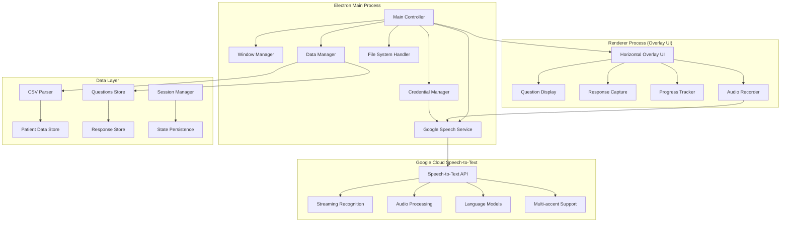

# Design Document

## Overview

The Speech Overlay Application is an Electron-based desktop application that provides a translucent, non-intrusive overlay interface for collecting speech-based responses to questionnaires. The application leverages Google Cloud Speech-to-Text API for reliable, high-quality speech recognition that works consistently across all platforms.

The application follows a modular architecture with clear separation between the Electron main process (Node.js backend), renderer process (HTML/CSS/JS frontend), and cloud speech processing components. The design prioritizes user experience through a seamless horizontal overlay interface similar to Cluely, while maintaining robust data handling and real-time speech recognition capabilities.

## Architecture

### High-Level Architecture



### Process Communication

- **Main Process**: Handles file operations, AI model management, and system-level window controls
- **Renderer Process**: Manages the overlay UI, user interactions, and real-time display updates
- **IPC Communication**: Secure message passing between main and renderer processes for data synchronization

## Components and Interfaces

### 1. Main Process Components

#### Window Manager
```typescript
interface WindowManager {
  createOverlayWindow(): BrowserWindow;
  setOverlayProperties(transparent: boolean, clickThrough: boolean): void;
  positionOverlay(position: OverlayPosition): void;
  toggleOverlayVisibility(): void;
}
```

**Responsibilities:**
- Create and manage the translucent overlay window
- Configure window properties for click-through behavior
- Handle window positioning and always-on-top functionality
- Manage window lifecycle and cleanup

#### Data Manager
```typescript
interface DataManager {
  loadPatientData(csvPath: string): Promise<PatientRecord[]>;
  loadQuestions(questionsPath: string): Promise<Question[]>;
  saveResponses(responses: ResponseData[]): Promise<string>;
  getCurrentSession(): SessionState;
  saveSessionState(state: SessionState): void;
}
```

**Responsibilities:**
- Parse and validate CSV patient data
- Load and validate question sets
- Manage session state persistence
- Export collected responses to CSV format

#### Google Speech Service
```typescript
interface GoogleSpeechService {
  initializeClient(credentials: GoogleCredentials): Promise<void>;
  createStreamingRecognition(config: RecognitionConfig): Promise<RecognitionStream>;
  startRealTimeRecognition(): Promise<void>;
  stopRecognition(): void;
  processAudioStream(audioBuffer: ArrayBuffer): Promise<void>;
  onTranscriptionResult(callback: (result: TranscriptionResult) => void): void;
  parseResponse(text: string): ResponseType;
  extractDateTime(text: string): Date | null;
  handleNetworkErrors(): void;
}
```

**Responsibilities:**
- Initialize and manage Google Cloud Speech-to-Text client
- Create and manage streaming recognition sessions
- Handle real-time audio streaming to Google's servers
- Process streaming recognition results and interim results
- Parse and categorize responses (Yes/No/NA/DateTime)
- Manage API authentication, rate limiting, and error handling
- Handle network connectivity issues and reconnection

### 2. Renderer Process Components

#### Overlay UI Controller
```typescript
interface OverlayUIController {
  displayQuestion(question: Question, patient: PatientRecord): void;
  showResponse(response: ProcessedResponse): void;
  enableResetOption(): void;
  updateProgress(current: number, total: number): void;
  showError(message: string): void;
}
```

**Responsibilities:**
- Render questions with patient context
- Display captured responses with reset functionality
- Show progress indicators and error messages
- Handle UI state transitions

#### Audio Capture Handler
```typescript
interface AudioCaptureHandler {
  startListening(): Promise<void>;
  stopListening(): void;
  getAudioBuffer(): ArrayBuffer;
  onAudioDetected(callback: (audio: ArrayBuffer) => void): void;
}
```

**Responsibilities:**
- Manage microphone access and audio recording
- Detect speech activity and silence periods
- Buffer audio data for processing
- Handle audio permissions and device selection

### 3. AI Processing Components

#### Credential Manager
```typescript
interface CredentialManager {
  loadCredentials(): Promise<GoogleCredentials>;
  saveCredentials(credentials: GoogleCredentials): Promise<void>;
  validateCredentials(credentials: GoogleCredentials): Promise<boolean>;
  encryptCredentials(credentials: GoogleCredentials): string;
  decryptCredentials(encryptedData: string): GoogleCredentials;
}
```

**Responsibilities:**
- Securely store and retrieve Google Cloud API credentials
- Validate API key and service account credentials
- Encrypt sensitive credential data at rest
- Handle credential rotation and updates
- Provide secure credential access to speech service

## Data Models

### Core Data Structures

```typescript
interface PatientRecord {
  mrn: string;
  name: string;
  additionalDetails: Record<string, any>;
}

interface Question {
  id: string;
  text: string;
  expectedResponseType: 'yes_no' | 'date_time' | 'not_applicable' | 'any';
  order: number;
}

interface ProcessedResponse {
  questionId: string;
  patientMrn: string;
  rawText: string;
  parsedValue: string | Date | boolean | null;
  responseType: ResponseType;
  confidence: number;
  timestamp: Date;
}

interface SessionState {
  currentPatientIndex: number;
  currentQuestionIndex: number;
  responses: ProcessedResponse[];
  isPaused: boolean;
  lastSaved: Date;
}

interface GoogleCredentials {
  type: 'api_key' | 'service_account';
  apiKey?: string;
  projectId?: string;
  privateKey?: string;
  clientEmail?: string;
}

interface RecognitionConfig {
  encoding: 'LINEAR16' | 'FLAC' | 'MULAW' | 'AMR' | 'AMR_WB' | 'OGG_OPUS' | 'SPEEX_WITH_HEADER_BYTE';
  sampleRateHertz: number;
  languageCode: string;
  alternativeLanguageCodes?: string[];
  maxAlternatives?: number;
  profanityFilter?: boolean;
  speechContexts?: SpeechContext[];
  enableWordTimeOffsets?: boolean;
  enableAutomaticPunctuation?: boolean;
  model?: string;
  useEnhanced?: boolean;
}

interface TranscriptionResult {
  transcript: string;
  confidence: number;
  isFinal: boolean;
  alternatives?: TranscriptionAlternative[];
}

interface TranscriptionAlternative {
  transcript: string;
  confidence: number;
}

enum ResponseType {
  YES = 'yes',
  NO = 'no',
  NOT_APPLICABLE = 'not_applicable',
  DATE_TIME = 'date_time',
  UNCLEAR = 'unclear'
}
```

### File Formats

#### Patient CSV Format
```csv
MRN,Name,DateOfBirth,Department,AdditionalInfo
12345,John Doe,1985-03-15,Cardiology,Room 101
67890,Jane Smith,1992-07-22,Neurology,Room 205
```

#### Questions Format
```json
[
  {
    "id": "q1",
    "text": "Do you have any allergies?",
    "expectedResponseType": "yes_no",
    "order": 1
  },
  {
    "id": "q2", 
    "text": "When was your last visit?",
    "expectedResponseType": "date_time",
    "order": 2
  }
]
```

## Error Handling

### Error Categories and Strategies

1. **File Loading Errors**
   - Invalid CSV format: Display specific validation errors
   - Missing files: Provide clear file selection guidance
   - Permission errors: Request appropriate file access

2. **Google API Errors**
   - Authentication failures: Clear credential setup guidance
   - Network connectivity issues: Retry mechanism with offline mode notification
   - API rate limiting: Automatic backoff and retry strategies
   - Service unavailability: Graceful degradation with user notification

3. **Audio Processing Errors**
   - Microphone access denied: Clear permission instructions
   - No audio detected: Visual feedback and retry prompts
   - Audio quality issues: Noise filtering and enhancement

4. **System Integration Errors**
   - Overlay rendering issues: Fallback to standard window mode
   - Click-through failures: Alternative interaction methods
   - Cross-platform compatibility: Platform-specific implementations

### Error Recovery Mechanisms

```typescript
interface ErrorHandler {
  handleFileError(error: FileError): void;
  handleAIError(error: AIError): void;
  handleAudioError(error: AudioError): void;
  recoverFromCriticalError(): Promise<void>;
}
```

## Testing Strategy

### Unit Testing
- **Data Processing**: CSV parsing, question validation, response categorization
- **Google API Integration**: Mock Google Speech-to-Text responses, response parsing accuracy
- **Audio Handling**: Audio buffer management, speech detection algorithms
- **UI Components**: Overlay rendering, user interaction handling
- **Credential Management**: Secure storage and retrieval of API credentials

### Integration Testing
- **End-to-End Workflows**: Complete questionnaire cycles from CSV load to export
- **Cross-Process Communication**: IPC message handling between main and renderer
- **File System Operations**: CSV import/export, session state persistence
- **Google Speech API Integration**: Real Google Speech-to-Text testing with sample audio
- **Network Resilience**: Testing with network interruptions and API failures

### Platform Testing
- **Windows Compatibility**: Overlay behavior, audio permissions, packaging
- **macOS Compatibility**: Window management, security permissions, app signing
- **Performance Testing**: Memory usage, model loading times, response latency

### Accessibility Testing
- **Keyboard Navigation**: Alternative input methods for overlay interaction
- **Screen Reader Compatibility**: Proper ARIA labels and announcements
- **High Contrast Support**: Overlay visibility in different display modes

## Performance Considerations

### API Optimization
- **Streaming Recognition**: Use Google's streaming API for real-time results
- **Connection Management**: Efficient connection pooling and reuse
- **Audio Compression**: Optimize audio encoding for faster transmission
- **Caching**: Cache common responses and configurations

### UI Responsiveness
- **Async Operations**: Non-blocking API calls with progress indicators
- **Smooth Animations**: Hardware-accelerated overlay transitions
- **Resource Cleanup**: Proper disposal of audio streams and API connections

### Packaging Optimization
- **Bundle Size**: Minimize included dependencies (no large AI models)
- **Startup Time**: Lazy loading of non-critical components
- **Update Mechanism**: Automatic updates for application improvements