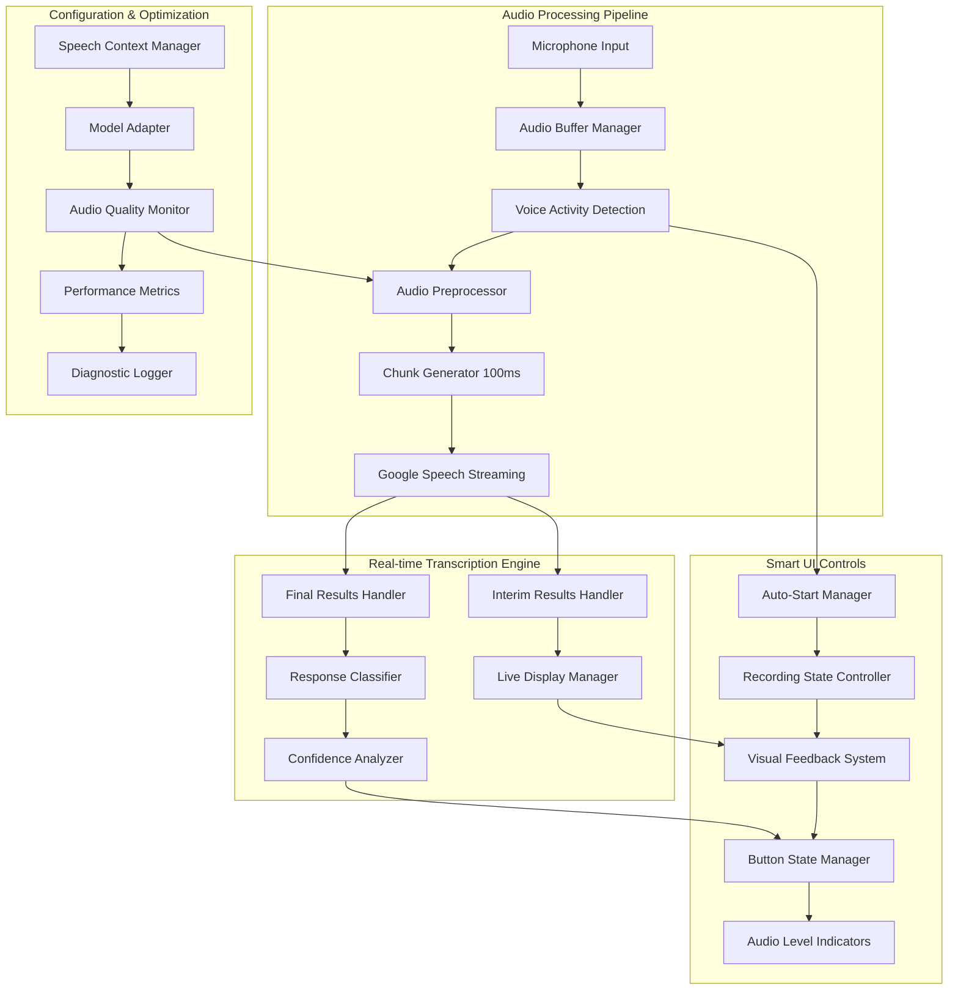

# Design Document

## Overview

This design document outlines the optimization strategy for the existing live transcription functionality to address four critical issues: high latency, poor button UX, empty transcription results, and accuracy problems with "Yes" responses and dates. The solution focuses on Google Speech-to-Text streaming optimization, enhanced audio processing, intelligent UI controls, and comprehensive configuration tuning.

The design leverages Google's streaming recognition with interim results, implements proper audio chunking for minimal latency, introduces smart recording controls with auto-start functionality, and uses speech adaptation features to boost accuracy for common response patterns.

## Architecture

### Enhanced Streaming Architecture



## Components and Interfaces

### 1. Latency Optimization Components

#### Streaming Audio Manager
```typescript
interface StreamingAudioManager {
  initializeStream(config: OptimizedStreamConfig): Promise<void>;
  startRealTimeStreaming(): void;
  processAudioChunk(chunk: ArrayBuffer): Promise<void>;
  handleInterimResults(result: InterimResult): void;
  handleFinalResults(result: FinalResult): void;
  optimizeLatency(): void;
}

interface OptimizedStreamConfig {
  chunkSizeMs: 100; // 100ms chunks for minimal latency
  sampleRate: 16000; // Optimal for Google Speech
  encoding: 'LINEAR16';
  enableInterimResults: true;
  singleUtterance: false; // For continuous listening
  maxAlternatives: 1; // Reduce processing overhead
  enableAutomaticPunctuation: true;
  model: 'latest_long' | 'latest_short'; // Based on expected response length
}
```

**Responsibilities:**
- Process audio in 100ms chunks for minimal latency
- Handle Google Speech streaming with interim results enabled
- Optimize buffer management for real-time performance
- Manage connection persistence and reconnection

#### Real-time Display Controller
```typescript
interface RealTimeDisplayController {
  displayInterimText(text: string, confidence: number): void;
  updateLiveTranscription(text: string): void;
  finalizeTranascription(text: string, confidence: number): void;
  showLatencyMetrics(latency: number): void;
  highlightUncertainWords(words: UncertainWord[]): void;
}

interface UncertainWord {
  text: string;
  confidence: number;
  startTime: number;
  endTime: number;
}
```

**Responsibilities:**
- Display interim results immediately (<200ms)
- Update transcription text in real-time
- Provide visual confidence indicators
- Show performance metrics for debugging

### 2. Smart Recording Controls

#### Recording State Manager
```typescript
interface RecordingStateManager {
  autoStartListening(): Promise<void>;
  toggleRecording(): Promise<RecordingState>;
  getCurrentState(): RecordingState;
  onStateChange(callback: (state: RecordingState) => void): void;
  showVisualFeedback(state: RecordingState): void;
}

enum RecordingState {
  INITIALIZING = 'initializing',
  LISTENING = 'listening', 
  PROCESSING = 'processing',
  PAUSED = 'paused',
  ERROR = 'error'
}

interface RecordingControls {
  buttonText: string;
  buttonColor: string;
  iconType: 'microphone' | 'stop' | 'play' | 'loading';
  showAudioLevels: boolean;
  showSpeechActivity: boolean;
}
```

**Responsibilities:**
- Auto-start listening when overlay loads
- Provide clear Start/Stop button behavior
- Show real-time recording state with visual feedback
- Display audio levels and speech activity indicators

#### Visual Feedback System
```typescript
interface VisualFeedbackSystem {
  showRecordingState(state: RecordingState): void;
  displayAudioLevels(level: number): void;
  indicateSpeechActivity(isActive: boolean): void;
  showConfidenceIndicator(confidence: number): void;
  displayLatencyWarning(latency: number): void;
}
```

**Responsibilities:**
- Provide immediate visual feedback for all recording states
- Show real-time audio level meters
- Indicate when speech is being detected
- Display confidence and performance indicators

### 3. Empty Results Prevention

#### Audio Quality Monitor
```typescript
interface AudioQualityMonitor {
  monitorAudioLevels(): AudioQualityMetrics;
  detectSilence(durationMs: number): boolean;
  assessMicrophoneQuality(): MicrophoneQuality;
  suggestImprovements(): QualityImprovement[];
  enableNoiseSupression(): void;
}

interface AudioQualityMetrics {
  averageLevel: number;
  peakLevel: number;
  noiseFloor: number;
  signalToNoiseRatio: number;
  clippingDetected: boolean;
}

interface QualityImprovement {
  issue: 'low_volume' | 'background_noise' | 'poor_microphone' | 'clipping';
  suggestion: string;
  severity: 'low' | 'medium' | 'high';
}
```

**Responsibilities:**
- Monitor audio quality in real-time
- Detect common issues causing empty results
- Provide specific improvement suggestions
- Apply automatic audio enhancements

#### Fallback Response Handler
```typescript
interface FallbackResponseHandler {
  detectEmptyResults(): boolean;
  promptUserForSpeech(): void;
  offerManualInput(): void;
  retryWithAdjustedSettings(): Promise<void>;
  logEmptyResultCause(cause: EmptyResultCause): void;
}

enum EmptyResultCause {
  NO_SPEECH_DETECTED = 'no_speech_detected',
  AUDIO_TOO_QUIET = 'audio_too_quiet', 
  BACKGROUND_NOISE = 'background_noise',
  API_ERROR = 'api_error',
  NETWORK_ISSUE = 'network_issue'
}
```

**Responsibilities:**
- Detect and categorize empty result causes
- Provide appropriate user guidance
- Offer manual input fallback
- Retry with optimized settings

### 4. Accuracy Enhancement System

#### Speech Context Optimizer
```typescript
interface SpeechContextOptimizer {
  createYesNoContexts(): SpeechContext[];
  createDateTimeContexts(): SpeechContext[];
  createMedicalContexts(): SpeechContext[];
  optimizeBoostValues(): ContextBoostConfig;
  updateContextsBasedOnAccuracy(accuracy: AccuracyMetrics): void;
}

interface SpeechContext {
  phrases: string[];
  boost: number; // 10-20 for critical responses
}

interface ContextBoostConfig {
  yesResponses: {
    phrases: ['yes', 'yeah', 'yep', 'yup', 'affirmative', 'correct', 'right', 'true', 'absolutely'];
    boost: 15;
  };
  noResponses: {
    phrases: ['no', 'nope', 'negative', 'incorrect', 'wrong', 'false', 'nah', 'never'];
    boost: 15;
  };
  datePatterns: {
    phrases: ['january', 'february', 'march', 'april', 'may', 'june', 'july', 'august', 'september', 'october', 'november', 'december', 'first', 'second', 'third', 'fourth', 'fifth', 'sixth', 'seventh', 'eighth', 'ninth', 'tenth', 'eleventh', 'twelfth', 'thirteenth', 'fourteenth', 'fifteenth', 'sixteenth', 'seventeenth', 'eighteenth', 'nineteenth', 'twentieth', 'twenty first', 'twenty second', 'twenty third', 'twenty fourth', 'twenty fifth', 'twenty sixth', 'twenty seventh', 'twenty eighth', 'twenty ninth', 'thirtieth', 'thirty first'];
    boost: 12;
  };
}
```

**Responsibilities:**
- Create optimized speech contexts for common responses
- Boost recognition of Yes/No variations
- Enhance date and time recognition
- Adapt contexts based on accuracy feedback

#### Enhanced Model Configuration
```typescript
interface EnhancedModelConfig {
  selectOptimalModel(responseType: ResponseType): ModelSelection;
  configureForMedicalUse(): RecognitionConfig;
  optimizeForShortResponses(): RecognitionConfig;
  enableEnhancedAccuracy(): RecognitionConfig;
}

interface ModelSelection {
  model: 'latest_short' | 'latest_long' | 'medical_dictation' | 'medical_conversation';
  useEnhanced: boolean;
  alternativeLanguageCodes: string[]; // ['en-US', 'en-IN', 'en-CA'] for accent support
  maxAlternatives: number;
}
```

**Responsibilities:**
- Select optimal models for different response types
- Configure enhanced models when available
- Support multiple English variants for accent recognition
- Balance accuracy vs. cost considerations

## Data Models

### Enhanced Configuration Models

```typescript
interface OptimizedTranscriptionConfig {
  // Latency optimization
  streaming: {
    chunkSizeMs: 100;
    enableInterimResults: true;
    interimResultsUpdateIntervalMs: 50;
    maxStreamingDurationMs: 300000; // 5 minutes
  };
  
  // Audio processing
  audio: {
    sampleRateHertz: 16000;
    encoding: 'LINEAR16';
    enableNoiseSupression: true;
    enableAutomaticGainControl: true;
    audioChannels: 1;
  };
  
  // Accuracy enhancement
  recognition: {
    model: 'latest_short';
    useEnhanced: true;
    languageCode: 'en-US';
    alternativeLanguageCodes: ['en-IN', 'en-CA', 'en-GB'];
    enableAutomaticPunctuation: true;
    enableWordTimeOffsets: true;
    maxAlternatives: 1;
    profanityFilter: false;
  };
  
  // Speech contexts for accuracy
  speechContexts: SpeechContext[];
  
  // Performance monitoring
  monitoring: {
    enableLatencyTracking: true;
    enableConfidenceLogging: true;
    enableAudioQualityMetrics: true;
    logEmptyResults: true;
  };
}

interface PerformanceMetrics {
  latency: {
    audioToInterim: number; // Target: <200ms
    interimToFinal: number; // Target: <500ms
    endToEndLatency: number; // Target: <1000ms
  };
  
  accuracy: {
    overallConfidence: number;
    yesNoAccuracy: number;
    dateTimeAccuracy: number;
    emptyResultRate: number;
  };
  
  audioQuality: {
    averageSignalLevel: number;
    noiseLevel: number;
    clippingRate: number;
    silenceDetectionAccuracy: number;
  };
}

interface DiagnosticData {
  timestamp: Date;
  audioMetrics: AudioQualityMetrics;
  transcriptionResult: TranscriptionResult;
  performanceMetrics: PerformanceMetrics;
  errorDetails?: ErrorDetails;
  userFeedback?: UserFeedback;
}
```

## Error Handling

### Comprehensive Error Recovery

```typescript
interface OptimizedErrorHandler {
  handleLatencyIssues(latency: number): Promise<void>;
  handleEmptyResults(cause: EmptyResultCause): Promise<void>;
  handleAccuracyIssues(confidence: number): Promise<void>;
  handleAudioQualityIssues(quality: AudioQualityMetrics): Promise<void>;
  recoverFromAPIErrors(error: GoogleSpeechError): Promise<void>;
}
```

### Error Recovery Strategies

1. **High Latency Recovery**
   - Reduce chunk size to 50ms temporarily
   - Switch to faster model if available
   - Optimize network connection
   - Provide user feedback about performance

2. **Empty Results Recovery**
   - Increase microphone sensitivity
   - Apply noise suppression
   - Prompt user to speak louder/clearer
   - Offer manual input fallback

3. **Low Accuracy Recovery**
   - Increase speech context boost values
   - Switch to enhanced model
   - Request user to repeat response
   - Provide confidence-based suggestions

## Testing Strategy

### Performance Testing
- **Latency Benchmarks**: Measure end-to-end latency under various conditions
- **Accuracy Testing**: Test recognition accuracy with various accents and response types
- **Audio Quality Testing**: Test with different microphones and noise levels
- **Stress Testing**: Continuous operation for extended periods

### User Experience Testing
- **Button Behavior**: Test auto-start and state transitions
- **Visual Feedback**: Verify all indicators work correctly
- **Error Scenarios**: Test recovery from various error conditions
- **Accessibility**: Ensure visual indicators are accessible

### Integration Testing
- **Google Speech API**: Test with real API under various network conditions
- **Audio Pipeline**: Test complete audio processing chain
- **Configuration Management**: Test dynamic configuration updates
- **Cross-platform**: Verify functionality on Windows and macOS

## Implementation Priorities

### Phase 1: Latency Optimization (High Priority)
- Implement 100ms audio chunking
- Enable interim results processing
- Optimize streaming configuration
- Add real-time display updates

### Phase 2: Smart Controls (High Priority)  
- Implement auto-start functionality
- Create dynamic button states
- Add visual feedback system
- Implement audio level indicators

### Phase 3: Accuracy Enhancement (Medium Priority)
- Create speech context optimization
- Implement enhanced model selection
- Add confidence analysis
- Create response pattern boosting

### Phase 4: Diagnostics & Monitoring (Medium Priority)
- Implement performance metrics
- Add diagnostic logging
- Create quality monitoring
- Build troubleshooting tools

This design provides a comprehensive solution to address all four critical issues while maintaining the existing functionality and improving the overall user experience.